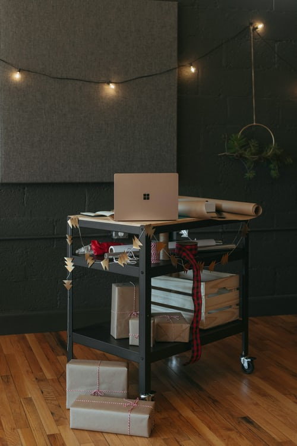
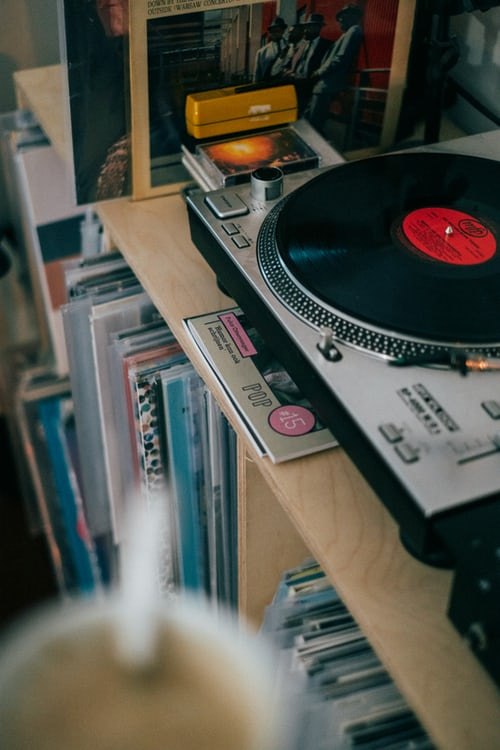

GitHub Page  https://olegkolovanov.github.io/mesto/

В этом сайте пока что можно только менять данные у юзера(юзернейм и хобби) с помощью попапа. Попап вызвается на кнопку редактирования, если в попапе нажать на кнопку "Сохранить". то изменения сохраняются и переносятся в профиль, если нажать на крестик, то изменения не сохраняются

Что можно улучшить: 1. Функцию добавления фотографий
                    2. Функцию лайков

                            

          
          

            <button class="element__like-button" type="button"></button>
            <h2 class="element__title">Работа</h2>
          

        

        

          
          

            <button class="element__like-button" type="button"></button>
            <h2 class="element__title">Рабочее пространство</h2>
          

        

        

          
          

            <button class="element__like-button" type="button"></button>
            <h2 class="element__title">Хобби</h2>
          

        

        

          
          

            <button class="element__like-button" type="button"></button>
            <h2 class="element__title">Хобби</h2>
          

        

        

          
          

            <button class="element__like-button" type="button"></button>
            <h2 class="element__title">Рабочее пространство</h2>
          

        

        

          
          

            <button class="element__like-button" type="button"></button>
            <h2 class="element__title">Работа</h2>
          

        

        initialCards.forEach(function (element){
  const typeElement = elementTemplate.querySelector('.element').cloneNode(true);
  typeElement.querySelector('.element__photo').src = element.link;
  typeElement.querySelector('.element__title').textContent = element.name;
  typeElement.querySelector('.element__like-button').addEventListener('click', function(evt){
    evt.target.classList.toggle('element__like-button_active')
  });
  elements.append(typeElement);
  console.log(typeElement)
  typeElement.querySelector('.element__trash').addEventListener('click', function(){
   typeElement.remove(); 
  });
});